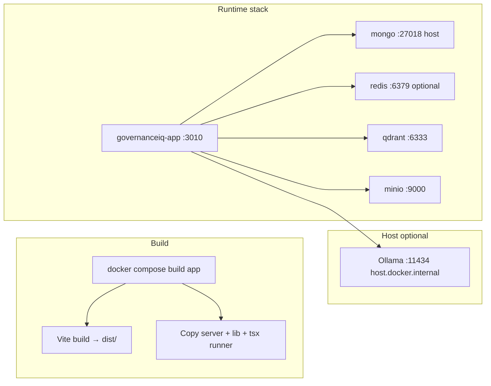

# Target Folder Structure & Prioritized Backlog

**Status:** Track A complete (A2–A4); PR-8 complete — PR-9 next  
**Last updated:** 2026-06-14  
**Related:** [architecture.md](./architecture.md), ADR-01 through ADR-08

---

## 1. Current deploy flow (Docker)



| Step | Command | Notes |
|------|---------|--------|
| Local full stack | `docker compose up --build` | `.env` required; overrides `MONGODB_URI` to `mongo:27017` inside app |
| Rebuild after server/lib change | `docker compose build app && docker compose up -d app` | **Runner image does not hot-reload** — must rebuild |
| Rebuild after frontend only | Same (Vite build in Docker builder stage) | Or `npm run build` + restart if not using Docker for app |
| Ollama on Mac host | `OLLAMA_BASE_URL=http://host.docker.internal:11434` | GPU on host, not in compose |
| KB re-index | UI “Re-index all” or ingest API | Ollama embedding is slow; plan maintenance window |
| KB ingest queue | BullMQ on `REDIS_URL` | **Redis optional** — unset/unreachable degrades to inline (in-process) ingest (`server/lib/rag/kbIngestQueue.ts`) |
| Health | `GET /api/health`, `GET /api/kb-rag/health` | Add auth smoke tests after ADR-03 |

**Deploy gap today:** No CI/CD in repo; production is manual image build + env secrets. Backlog item **P0-DEPLOY-1** adds a minimal pipeline.

---

## 2. Open work mapping

`main` at `98dd57c` (RAG/Ollama/Lokal AI shipped). **Track A (A2–A4) complete** — see [smoke-checklist.md](./smoke-checklist.md) and [prod-env-template.md](./prod-env-template.md).

| Theme | Status |
|-------|--------|
| RAG hybrid + Cohere rerank | Shipped; `KB_HYBRID_SEARCH_ENABLED=true` in local `.env` |
| Ollama GPU + embedding | Shipped + documented |
| Lokal AI strict prompt | Shipped |
| KB ingest UX | Shipped |
| Smoke automation | `scripts/smoke-ship-stabilize.ts` |

**Next:** **PR-2** Security quick wins (B1–B3).

---

## 3. Target frontend structure (`src/features/`)

Principle: **pages stay thin**; features own UI + hooks + API; shared kit stays in `src/shared/` (gradual rename from scattered `lib/`).

```
src/
├── app/                          # App shell only
│   ├── App.tsx                   # Routes (move from root)
│   ├── routes.tsx                # Route table + lazy imports
│   └── providers.tsx             # Auth, Settings, QueryClient
│
├── features/
│   ├── auth/
│   │   ├── api/                  # login, OTP, reset — no db.ts
│   │   ├── components/
│   │   └── pages/                # LoginPage, ResetPasswordPage
│   │
│   ├── tasks/                    # Görevlerim (pilot for TanStack Query)
│   │   ├── api/                  # assignmentManageApi, task autofill
│   │   ├── components/           # move from components/tasks/*
│   │   ├── hooks/                # useMyAssignments, useTaskAutofill
│   │   └── pages/                # TasksPage
│   │
│   ├── projects/
│   │   ├── api/
│   │   ├── components/
│   │   │   └── project-detail/   # ADR-02: one folder per tab
│   │   │       ├── QuestionsTab.tsx
│   │   │       ├── AssignmentsTab.tsx
│   │   │       ├── PlanTab.tsx
│   │   │       ├── UsersTab.tsx
│   │   │       ├── ComplianceTab.tsx
│   │   │       └── ActivitiesTab.tsx
│   │   ├── hooks/
│   │   └── pages/
│   │       ├── ProjectsPage.tsx
│   │       └── ProjectDetailPage.tsx   # < 300 lines: layout + tab router
│   │
│   ├── customers/
│   │   ├── api/
│   │   ├── components/           # move from components/customer/*
│   │   └── pages/
│   │
│   ├── knowledge-base/
│   │   ├── api/                  # kbRag.ts, ingest helpers
│   │   ├── components/
│   │   └── pages/
│   │
│   ├── templates/
│   │   ├── api/
│   │   ├── components/           # QuestionExplorer, excel import (lazy)
│   │   └── pages/
│   │
│   ├── settings/
│   │   ├── components/           # LlmSettingsPanel, etc.
│   │   └── pages/
│   │
│   ├── audit/
│   ├── emissions/
│   ├── compliance/               # move from components/compliance
│   ├── contact-response/         # magic-link public flow
│   │
│   └── admin-shell/              # Dashboard, Users, Translations
│       └── components/           # AdminLayout, PageHelpGuidance
│
├── shared/
│   ├── api/
│   │   ├── client.ts             # apiClient (rename path)
│   │   └── errors.ts             # parseApiError
│   ├── ui/                       # shadcn + primitives (grow from components/ui)
│   ├── hooks/
│   │   └── useTranslation.ts
│   ├── lib/                      # pure utils (no feature logic)
│   ├── types/                    # re-export or migrate from src/types
│   └── i18n/
│       ├── index.ts              # loader
│       ├── en/
│       │   ├── nav.json
│       │   ├── tasks.json
│       │   └── settings.json
│       └── tr/
│           └── ...
│
├── legacy/
│   └── db.ts                     # Firestore shim — shrink only; delete emulation block first
│
└── main.tsx
```

### Migration rules (avoid big-bang)

1. **Move, don’t rewrite:** `git mv src/components/tasks → src/features/tasks/components` + fix imports.
2. **One feature per PR** after foundation PR (Query + ui kit).
3. **New code never imports `legacy/db.ts`** — use `features/*/api`.
4. **Pages import features**, not vice versa.
5. **Lazy load** heavy tabs and `templates`, `excel`, `gemini` at route level.

### Import alias (optional `tsconfig`)

```json
"paths": {
  "@/features/*": ["./src/features/*"],
  "@/shared/*": ["./src/shared/*"]
}
```

---

## 4. Target backend structure

Align with ADR-01 + ADR-07. `server.ts` becomes bootstrap only (~150 lines).

```
server/
├── index.ts                      # createApp(), register routes (future: replace server.ts body)
├── config/
│   └── env.ts                    # zod-validated env
├── middleware/
│   ├── auth.ts                   # resolvePlatformUserFromRequest
│   ├── requireRole.ts
│   └── validate.ts               # zod body helper
├── routes/                       # thin handlers only
│   ├── auth.routes.ts            # extract from server.ts
│   ├── assignments.routes.ts
│   ├── projects.routes.ts
│   ├── mongoApi.ts               # shrink; policy-wrapped
│   ├── kbRagRoute.ts
│   ├── llmSettingsRoute.ts
│   ├── assignmentManage.ts
│   └── ...
├── services/                     # ADR-07 — business logic
│   ├── assignments/
│   │   ├── mergeAssignments.ts
│   │   ├── quickAssignment.ts
│   │   └── notifyAssignment.ts
│   ├── answers/
│   ├── kb/
│   │   ├── ingestDocument.ts     # move from ingestKbDocument orchestration
│   │   └── searchCustomerKb.ts
│   ├── tasks/
│   │   └── autofillQuestion.ts   # taskQuestionAutofill orchestration
│   └── auth/
├── policies/                     # ADR-03
│   ├── canReadResource.ts
│   ├── canWriteProject.ts
│   └── mongoResourcePolicy.ts
├── lib/                          # infra adapters (email, s3, llm providers)
├── models/
└── db/

lib/                              # shared isomorphic (keep)
├── platformRoles.ts
├── contracts/                    # NEW: zod schemas shared with client (optional)
│   ├── assignment.ts
│   └── kb.ts
```

---

## 5. Prioritized backlog

Effort: **S** ≤2d, **M** ≤1w, **L** 2–3w, **XL** ≥1 month.

### Track A — Ship & stabilize (current work)

| ID | Item | Effort | PR | Docker note |
|----|------|--------|-----|-------------|
| A1 | Commit & PR: RAG/Ollama/Lokal AI + import fix | M | **PR-1** | Done `98dd57c` |
| A2 | Smoke checklist: Lokal AI, Genel AI, KB re-index, assignment email | S | PR-1 QA | [smoke-checklist.md](./smoke-checklist.md) + `npm run smoke:ship` |
| A3 | Enable `KB_HYBRID_SEARCH_ENABLED` + Cohere in prod `.env` | S | Ops | Hybrid on locally; Cohere optional |
| A4 | Document prod `.env` template (Ollama URL, secrets) | S | Docs | [prod-env-template.md](./prod-env-template.md) |

### Track B — Security & reliability (ADR Phase 1–2)

| ID | Item | Effort | PR | Blocks |
|----|------|--------|-----|--------|
| B1 | Auth middleware on all `GET /api/db/*` | S | **PR-2** | — |
| B2 | Remove JWT fallback secrets; fail boot if missing | S | PR-2 | — |
| B3 | `helmet` + baseline CSP | S | PR-2 | — |
| B4 | Extract `server.ts` auth routes → `routes/auth.routes.ts` | M | **PR-3** | — |
| B5 | Row-level policies for projects, answers, customers | L | **PR-4** | B1 |
| B6 | Zod on auth + assignment + kb-rag routes | M | **PR-5** | — |
| B7 | `buildApp()` factory for tests (replace makeApp partial) | M | PR-5 | — |

### Track C — UI & maintainability (frontend)

| ID | Item | Effort | PR | Depends |
|----|------|--------|-----|---------|
| C1 | Add TanStack Query + `app/providers.tsx` | S | **PR-6** | Done |
| C2 | shadcn/ui bootstrap + Button, Input, Dialog | M | PR-6 | Done (pilot in LLM settings) |
| C3 | Migrate **Tasks** feature folder + Query hooks | M | **PR-7** | Done |
| C4 | Migrate **Knowledge Base** feature + Query | M | **PR-8** | Done |
| C5 | Lazy routes in `app/routes.tsx` (cut initial bundle) | M | **PR-9** | — |
| C6 | Split `ProjectDetailPage` tab 1 (Questions) | L | **PR-10** | ADR-02 |
| C7 | Remaining tabs (Assignments, Plan, …) | XL | PR-11–15 | C6 |
| C8 | Split `i18n.ts` → `shared/i18n/{en,tr}/*.json` | M | PR-16 | — |
| C9 | `features/*/api` replaces `db.ts` for tasks/projects | L | **PR-17** | C3, C6 |

### Track D — Backend services

| ID | Item | Effort | PR | Depends |
|----|------|--------|-----|---------|
| D1 | `services/tasks/autofillQuestion.ts` | M | PR-18 | — |
| D2 | `services/kb/ingestDocument.ts` | M | PR-18 | — |
| D3 | `services/assignments/*` (merge, quick, notify) | L | PR-19 | B4 |
| D4 | Delete Firestore emulation block in `db.ts` | S | PR-20 | C9 partial |

### Track E — Deploy & ops

| ID | Item | Effort | PR | Notes |
|----|------|--------|-----|-------|
| E1 | GitHub Actions: `lint` + `test:server` on PR | S | **PR-21** | No deploy yet |
| E2 | Docker: multi-stage cache + `lib/` copy verification in CI | S | PR-21 | Catch missing COPY |
| E3 | Health endpoint aggregation (mongo, redis, qdrant, ollama reachability) | M | PR-22 | Admin-only |
| E4 | Optional: separate `docker-compose.prod.yml` (no port publish mongo) | S | Ops | — |
| E5 | BrowserRouter + reverse proxy doc for `giq.theleadai.co.uk` | M | PR-23 | Nginx template |

---

## 6. Suggested PR sequence (6 months compressed)

```
PR-1  Ship RAG/Ollama/Lokal AI                         ✅ done
PR-6  Query + shadcn foundation (C1–C2)              ✅ done
PR-7  features/tasks (C3)                            ✅ done
PR-8  features/knowledge-base (C4)                  ✅ done
PR-9  Route lazy loading (C5)                       ← next
PR-5  Zod auth + kb (B6)
PR-4  Row-level auth (B5)
PR-10 First ProjectDetail tab split (C6)
PR-21 CI lint + test (E1–E2)
PR-18–19 Service layer (D1–D3)
PR-11–15 Remaining project tabs
PR-17 Retire db.ts hot paths (C9)
```

Parallel workstreams:

- **Stream 1 (security):** PR-2 → PR-3 → PR-4 → PR-5  
- **Stream 2 (UI):** PR-6 → PR-7 → PR-8 → PR-9 → PR-10  
- **Stream 3 (RAG/ops):** PR-1 → E3 health dashboard  

---

## 7. Definition of done per feature migration

When moving e.g. `tasks` to `src/features/tasks`:

- [ ] All imports updated; no new `db.ts` usage  
- [ ] API calls in `features/tasks/api/*.ts`  
- [ ] Loading/error via TanStack Query  
- [ ] Vitest: at least one hook or API test  
- [ ] `npm run lint` clean  
- [ ] Manual smoke on Docker stack  
- [ ] i18n keys referenced from split namespace (when C8 lands)

---

## 8. What stays unchanged

- MongoDB + Mongoose (no migration to Postgres in this plan)  
- Express + tsx runner in Docker (no Nest rewrite)  
- HashRouter until E5 (proxy + BrowserRouter)  
- Qdrant + Redis + optional Ollama on host  
- `lib/platformRoles.ts` shared contract  

---

## 9. Quick reference: file move map (first wave)

| Current | Target |
|---------|--------|
| `src/components/tasks/*` | `src/features/tasks/components/*` | ✅ PR-7 |
| `src/pages/admin/TasksPage.tsx` | `src/features/tasks/pages/TasksPage.tsx` | ✅ PR-7 |
| `src/lib/assignmentManageApi.ts` | `src/features/tasks/api/assignmentManage.ts` | ✅ re-export |
| `src/lib/kbRag.ts` | `src/features/knowledge-base/api/kbRag.ts` |
| `src/pages/admin/KnowledgeBase*.tsx` | `src/features/knowledge-base/pages/*` |
| `src/components/admin/LlmSettingsPanel.tsx` | `src/features/settings/components/LlmSettingsPanel.tsx` |
| `src/lib/apiClient.ts` | `src/shared/api/client.ts` |
| `src/components/ui/*` | `src/shared/ui/*` |

Update `App.tsx` imports only; routing table moves to `src/app/routes.tsx` in PR-6.
