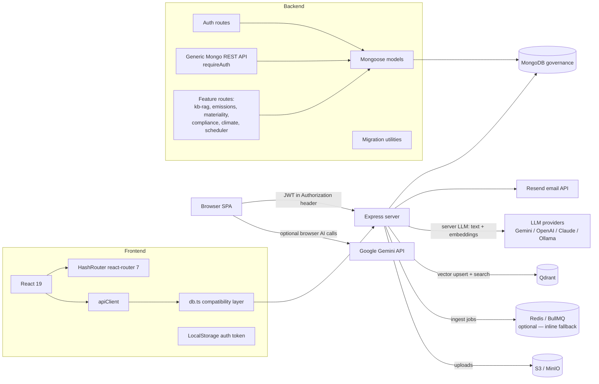

# GovernanceIQ Tech Stack and Architecture

Last updated: 2026-07-01

## 1. Executive Summary

GovernanceIQ is a React/Vite single-page application served by a Node.js Express backend. The application was migrated away from Firebase Auth and Firestore toward a local-first backend architecture based on Express, MongoDB, Mongoose, JWT authentication, and browser LocalStorage for session persistence.

Beyond the core reporting workflow (customers, projects, questionnaires, assignments), the platform now includes several **server-side** subsystems that did not exist in the original Firebase build:

- A **multi-provider server LLM layer** (Gemini, OpenAI, Claude, Ollama) under `server/lib/llm/`, configured at runtime through `lib/llmSettings.ts` and the Settings → LLM UI.
- A **knowledge-base RAG subsystem** under `server/lib/rag/` (document ingest, embeddings, Qdrant vector store, MongoDB text search, hybrid RRF retrieval, rerank, and a BullMQ + Redis ingest queue with inline fallback).
- **Compliance, emissions, and double-materiality (DMA)** engines, each with dedicated route modules and Mongoose models.
- **Transactional email through Resend** (replacing Brevo), with delivery/bounce webhooks feeding the audit log.

The current application is a single repository with:

- A React admin/contact frontend under `src/`.
- An Express API and server-side integration layer in `server.ts` (~1,870 lines) and `server/` — feature routes are increasingly extracted into `server/routes/*` modules registered from `server.ts`.
- MongoDB persistence through Mongoose models in `server/models/index.ts` (~40 models).
- A frontend data compatibility layer in `src/services/db.ts` that preserves much of the old Firestore-style call shape while routing requests to `/api/db/*`.
- Migration scripts under `scripts/` for importing and validating Firestore export data, plus seed/demo-snapshot tooling.

## 2. Runtime Architecture



## 3. Tech Stack

### Frontend

- React 19 with TypeScript.
- Vite 6 as dev server and production bundler.
- React Router 7 for route-level navigation.
- Tailwind CSS 4 via `@tailwindcss/vite`.
- Motion, Lucide React, React Markdown, TipTap, XLSX, and date-fns for UI/product features.
- Browser LocalStorage for auth token persistence through `src/lib/authToken.ts`.
- A centralized fetch wrapper in `src/lib/apiClient.ts`.

### Backend

- Node.js with TypeScript executed through `tsx`.
- Express 4 as the HTTP server.
- Mongoose 9 as MongoDB ODM.
- JSON Web Tokens via `jsonwebtoken`.
- Email delivery is primarily through the **Resend** SDK (`server/lib/resendEmail.ts`, `sendResendEmail`) for OTP, assignment, and password-reset mail; a Nodemailer transport loaded from the `EmailSettings` Mongoose model remains available for SMTP-configured flows. (Brevo was the previous provider and is fully replaced; only legacy comments/audit-id parsing reference it.)
- Delivery/bounce webhooks are received at `server/routes/resendWebhook.ts` and recorded in the audit log.
- Background jobs use **BullMQ** on **Redis** (`ioredis`) for KB document ingest, and an in-process scheduler (`server/lib/schedulerService.ts`) for MongoDB backups.
- Vite middleware is mounted by Express in development; static `dist/` assets are served in production.

### Database

- MongoDB database name: `governance`.
- Default local URI: `mongodb://localhost:27018/governance`.
- Override through `MONGODB_URI`.
- Models are centralized in `server/models/index.ts`.
- Every app schema includes:
  - `legacyFirebaseId` for migration compatibility.
  - `createdBy` and `ownerId` fields for ownership/audit use cases.
  - Mongoose timestamps.
  - Virtual `id` mapped from `_id` for frontend compatibility.

### AI and Integrations

AI now runs on **both** the browser and the server. The original "browser-only Gemini" description no longer holds.

**Server-side LLM (primary).** A provider-abstraction layer lets an admin choose the active text and embedding provider at runtime (Settings → LLM), persisted in `AppSetting` and resolved by `lib/llmSettings.ts`:

- Text providers: `gemini`, `openai`, `claude`, `ollama`.
- Embedding providers: `gemini`, `openai`, `ollama`.
- Provider adapters live in `server/lib/llm/providers/` (`gemini.ts`, `openai.ts`, `claude.ts`, `ollama.ts`). Gemini uses the `@google/genai` SDK; OpenAI, Claude (Anthropic Messages API), and Ollama are called directly over their REST endpoints via `fetch` — so no additional vendor SDKs are required.
- Orchestration/config: `server/lib/llm/llmService.ts`, `llmConfig.ts`, `ollamaHealth.ts`; HTTP surface in `server/routes/llmSettingsRoute.ts` (`GET/PUT /api/admin/llm-settings`, `POST /api/admin/llm-settings/ollama-health`).
- Env fallbacks apply until settings are saved in the UI (e.g. `GEMINI_API_KEY`, `OPENAI_API_KEY`, `ANTHROPIC_API_KEY`, `OLLAMA_BASE_URL`). Providers are lazily initialized, so missing keys never crash startup.

**Browser-side Gemini (secondary).** The `@google/genai` SDK is still used in `src/` for the Knowledge Chat and some content-generation UIs (`src/services/gemini.ts`, `src/services/tts.ts`, KnowledgeChatPage, ProjectDetailPage, TemplatesPage). This path requires `VITE_GEMINI_API_KEY` and is independent of the server LLM settings.

**Retrieval-augmented generation (RAG).** See [§4a](#4a-knowledge-base--rag-subsystem) for the full ingest/retrieval pipeline (Qdrant, embeddings, hybrid search, rerank, task/customer autofill).

**Email.** Transactional email is delivered through Resend; Nodemailer/`EmailSettings` is the secondary SMTP path.

## 4. Application Entry Points

### Development

```bash
PORT=3010 npm run dev
```

The dev command runs `tsx server.ts`. Express starts first, connects to MongoDB, registers API routes, then mounts Vite middleware.

### Production Build

```bash
npm run build
npm run start
```

The build command creates the Vite bundle in `dist/`. In production mode, Express serves static files from `dist/` and falls back to `dist/index.html` for SPA routing.

### Validation

```bash
npm run lint
```

This runs `tsc --noEmit`.

## 4a. Knowledge Base & RAG Subsystem

The RAG subsystem lives under `server/lib/rag/` and is exposed through `server/routes/kbRagRoute.ts` (routes under `/api/kb-rag/*`). It powers admin Knowledge Chat, task answer autofill (Lokal AI / Genel AI), and customer-profile autofill.

### Ingest pipeline

1. A KB document is uploaded and linked to a customer knowledge base (`KnowledgeBase` / `KBDocument`).
2. Indexing enqueues a job (`enqueueKbDocumentIngest`). The queue is **BullMQ on Redis** (`server/lib/rag/kbIngestQueue.ts`), gated by `REDIS_URL`.
   - **Redis is optional.** If `REDIS_URL` is unset, or set but unreachable, ingest **falls back to inline** (in-process) processing so documents are still indexed instead of stuck pending. The queue only adds durable, out-of-process background processing. A `KbIngestJob` document tracks status regardless of mode.
3. `ingestKbDocument.ts` chunks text (`chunkText.ts`), computes embeddings (`geminiEmbedding.ts` or the active embedding provider), stores chunks in MongoDB (`KbChunk`) and vectors in **Qdrant** (`qdrantStore.ts`, `QDRANT_URL`).

### Retrieval

- **Vector search** against Qdrant plus **MongoDB text search** (`mongoTextKbSearch.ts`).
- **Hybrid retrieval** (`hybridKbSearch.ts`) fuses both with Reciprocal Rank Fusion when `KB_HYBRID_SEARCH_ENABLED=true`.
- Optional **rerank** (`rerankKbHits.ts`) when a rerank provider/key is configured.
- Search entry points: `searchKnowledgeKb.ts` (admin chat), `searchCustomerKb.ts` and `taskQuestionKbSearch.ts` (autofill).

### Consumers

- **Knowledge Chat:** `knowledgeChatAnswer.ts`.
- **Task answer autofill:** `taskQuestionAutofill.ts` — `mode: 'local'` (KB-grounded) vs `mode: 'general'` (LLM only); `POST /api/kb-rag/tasks/autofill-answer`.
- **Customer profile autofill:** `customerAutofill.ts` / `customerAutofillGroups.ts`, plus `branchAutofill.ts` and `stakeholderAutofill.ts`; `POST /api/kb-rag/customers/:customerId/autofill`. See [ADR-08](adr/ADR-08-customer-rag-autofill.md).

### Health & status

`GET /api/kb-rag/health` reports Qdrant/embedding reachability, `redisQueue` (whether the BullMQ queue is active), and the effective ingest `mode` (`queue` vs `inline`). The worker is started at boot by `startKbIngestWorker()` in `server.ts` (skipped with a warning when `REDIS_URL` is unset).

## 5. Authentication Architecture

Authentication is now custom JWT-based auth.

### Client-Side Session Flow

1. User signs in through email/password or OTP.
2. Backend returns a JWT.
3. Frontend stores the token in LocalStorage through `src/lib/authToken.ts`.
4. `src/lib/apiClient.ts` attaches `Authorization: Bearer <token>` to API requests.
5. `src/lib/AuthContext.tsx` calls `/api/auth/me` on app boot to restore the session.
6. Logout clears the token and local auth state.

### Backend Auth Routes

Key routes live in `server.ts`:

- `POST /api/auth/login`
- `GET /api/auth/me`
- `POST /api/auth/logout`
- `POST /api/auth/otp/request`
- `POST /api/auth/otp/verify`
- `POST /api/auth/request-password-reset`
- `POST /api/auth/reset-password`
- `POST /api/auth/validate-token`
- `POST /api/auth/generate-token`
- `POST /api/admin/set-password`

### OTP Bootstrap Rule

Only the first user can be auto-created through OTP request. If the database has zero platform users, the requested email is created as `platform_admin` and receives OTP. If users already exist and the requested email is unknown, the backend returns a generic success message but does not create an OTP or send email.

This avoids account enumeration and prevents arbitrary self-registration.

## 6. API Architecture

The backend exposes two main API groups.

### Auth and Feature-Specific Routes

Auth/session and a few legacy endpoints are implemented directly in `server.ts`; most feature areas are now extracted into `server/routes/*` modules and registered from `server.ts` (each receives `{ jwtSecret }`). Key groups:

- Auth/session endpoints (login, me, logout, OTP, password reset, validate/generate contact tokens) — `server.ts`.
- Profile image upload: `POST /api/uploads/profile-image` (Multer → S3 or inline data URL); public files proxied via `server/lib/storageProxy.ts` (`/storage/...`).
- Assignment operations: `POST /api/projects/:id/quick-assignment`, `PATCH /api/projects/:id/quick-assignment`, `POST /api/projects/:id/merge-assignments`, plus `server/routes/assignmentManage.ts`.
- Assignment/reset email via Resend; delivery webhooks in `server/routes/resendWebhook.ts`.
- Admin/migration: contact-conflict analysis/migration, `GET/POST /api/admin/platform-api-key`.
- Customer API (API-key gated, `x-api-key`): `GET /api/v1/customer/customers|projects|project-data`.

Extracted feature route modules (all registered in `server.ts`):

| Module | Area | Path prefix |
|--------|------|-------------|
| `mongoApi.ts` | Generic CRUD + domain helpers | `/api/db/*`, `/api/settings/*` |
| `onBehalfResponse.ts` | On-behalf / auditor responses | `/api/projects/:id/assignments/:aid/*` |
| `assignmentManage.ts` | Assignment management access | `/api/...` |
| `auditReview.ts` | Auditor review decisions | `/api/projects/:id/answers/:aid/audit-review` |
| `kbRagRoute.ts` | Knowledge base / RAG | `/api/kb-rag/*` |
| `llmSettingsRoute.ts` | LLM provider settings | `/api/admin/llm-settings*` |
| `emissionsRoute.ts` | Emissions ledger & factors | `/api/emissions/*` |
| `materialityRoute.ts`, `griMaterialityRoute.ts` | Materiality matrices | `/api/materiality/*`, `/api/gri-materiality/*` |
| `griAssessmentRoute.ts`, `esrsAssessmentRoute.ts`, `issbAssessmentRoute.ts` | DMA scoring | `/api/dma/*-assessment` |
| `complianceRoute.ts` | Framework completeness & consistency | `/api/compliance/*` (mounted via `app.use`) |
| `climateRoute.ts` | Climate scenario analysis | `/api/climate/*` (mounted via `app.use`) |
| `schedulerRoute.ts` | Scheduled MongoDB backups | `/api/admin/scheduled-jobs` |
| `demoSeedRoute.ts` | Demo snapshot restore | `/api/demo/seed` |
| `resendWebhook.ts` | Email delivery webhooks | `/api/webhooks/resend` |

### Generic Mongo REST API

`server/routes/mongoApi.ts` registers generic CRUD endpoints for application resources:

- `GET /api/db/:resource`
- `POST /api/db/:resource`
- `POST /api/db/:resource/bulk`
- `GET /api/db/:resource/:id`
- `PATCH /api/db/:resource/:id`
- `PUT /api/db/:resource/:id`
- `DELETE /api/db/:resource/:id`

Supported resource names include:

- `segments`, `templates`, `templatePages`, `questions`, `domains`
- `customers`, `branches`, `contacts`
- `projects`, `projectPages`, `projectQuestions`, `projectUserAssignments`
- `assignments`, `answers`, `answerVersions`, `commentMessages`
- `platformUsers`, `auditLogs`, `translations`, `emailSettings`, `appSettings`
- `aiDrafts`, `knowledgeBases`, `kbDocuments`, `kbChunks`, `kbIngestJobs`
- `emissionFactors`, `emissionEntries`, `metricDefinitions`, `metricEntries`
- `materialityTopics`, `materialityAssessments`, `sectorCategories`

**Authorization note:** `registerMongoApiRoutes` is now invoked with `requireAuth: true` (`server.ts`), so every `/api/db/*` request — including `GET` — is rejected with `401` unless it carries a valid `Bearer` token (see `mongoApi.ts:274`). This closes the previously-Critical anonymous-read gap (I-2). **Row-level / tenant scoping (I-1) remains open:** writes stamp `createdBy`/`ownerId` but the generic API does not yet enforce per-resource ownership or `customerId` isolation. Feature route modules apply their own role checks (`requireAuth`, `requireIndexer`, etc.).

Additional helper routes registered by `mongoApi.ts`:

- `GET/PUT /api/settings/:key` — named app settings
- `POST /api/db/answers/upsert` — upsert answer with audit logging
- `POST /api/db/answers/:id/assignee-notes` — save assignee notes
- `POST /api/db/answers/:id/review-comments` — save review comment
- `POST /api/db/projects/create-from-template` — create project from template
- `POST /api/db/projects/:id/rebuild-from-template` — rebuild project questions
- `POST /api/db/projects/:id/clear-data` — clear all project answers

The generic API returns standardized envelopes:

```json
{ "success": true, "data": {} }
```

or:

```json
{ "success": false, "error": "Message", "code": "api/error" }
```

## 7. Frontend Data Access

The frontend uses `src/services/db.ts` (1,522 lines) as a compatibility layer. Lines 21-206 contain a dead Firestore-emulation block that is no longer active; lines 402-1521 contain live domain helpers still used by UI components. The layer intentionally preserves Firestore-like helpers:

- `collection`
- `doc`
- `query`
- `where`
- `orderBy`
- `limit`
- `getDocs`
- `getDoc`
- `addDoc`
- `setDoc`
- `updateDoc`
- `deleteDoc`
- `writeBatch`

Internally, these helpers map old collection paths to Mongo REST resources. Examples:

- `customers/:customerId/contacts` maps to `contacts` with `customerId`.
- `customers/:customerId/branches` maps to `branches` with `customerId`.
- `projects/:projectId/pages` maps to `projectPages` with `projectId`.
- `projects/:projectId/answers` maps to `answers` with `projectId`.
- `knowledgeBases/:kbId/documents` maps to `kbDocuments` with `kbId`.

This compatibility layer reduced the migration blast radius by allowing existing admin/contact screens to keep their previous data-access shape while moving transport and persistence to Express/MongoDB.

## 8. Data Model Overview

The domain model is Mongoose-based and tracks the main governance workflow:

- Template setup:
  - `Segment` — sector/segment classification
  - `Template` — questionnaire template linked to a segment
  - `TemplatePage` — page within a template
  - `Question` — bilingual question (`baslik`/`soru`/`ilgiliBirun`/`aciklama`/`ornekYanit`); supports `soruCogaltma` branch-multiplier
  - `Domain` — ESG/governance domain classification

- Customer structure:
  - `Customer` — organization profile including ESG summary, materiality assessment, CSRD scope, NACE/SASB classification, and financial profile
  - `Branch` — subsidiary/branch of a customer
  - `Contact` — external contact (email, role, linked to a customer)

- Project execution:
  - `Project` — a reporting project linking a template to a customer
  - `ProjectPage` — page instance within a project
  - `ProjectQuestion` — question instance cloned from template into a project (with branch expansion)
  - `ProjectUserAssignment` — role assignment of a platform user to a project (`admin`/`editor`/`viewer`/`contributor`)
  - `Assignment` — contact-level questionnaire assignment (generates magic-link access)
  - `Answer` — answer to a project question; tracks `submissionActors` for audit
  - `AnswerVersion` — historical version of an answer
  - `CommentMessage` — comment thread on a question/answer

- Platform administration:
  - `PlatformUser` — internal user with platform role (`platform_admin`, `consultant_manager`, `consultant`, `contributor`, `customer`, `auditor`)
  - `OtpCode` — one-time password for email-based login
  - `AuditLog` — platform-wide audit trail
  - `Translation` — bilingual string overrides (EN/TR)
  - `EmailSettings` — SMTP/Nodemailer configuration
  - `AppSetting` — named key-value app settings (also stores LLM provider settings)
  - `ScheduledJob` — scheduled MongoDB backup jobs (cron)
  - `SectorCategory` — sector/NACE classification reference data

- Knowledge base & RAG:
  - `KnowledgeBase` — knowledge base linked to a customer
  - `KBDocument` — document within a knowledge base
  - `KbIngestJob` — ingest job status (queue or inline)
  - `KbChunk` — chunked document text + embedding metadata (vectors stored in Qdrant)
  - `AIDraft` — AI-generated draft content

- Emissions & metrics:
  - `EmissionFactor` — emission factor reference data
  - `EmissionEntry` — Scope 1–3 ledger entry (calculated tCO₂e)
  - `EmissionIntensityInput`, `Scope2MarketData` — intensity denominators and market-based Scope 2 data
  - `MetricDefinition`, `MetricEntry` — structured metric entry with an approval workflow (DATA_ENTRY → MANAGER_REVIEW → HORIZON_REVIEW → APPROVED)

- Double materiality (DMA):
  - `MaterialityTopic`, `MaterialityAssessment` — topic catalog and per-customer assessment
  - `GRIMaterialityMatrixRow` — GRI matrix design rows
  - `GRIAssessmentScore`, `ESRSAssessmentScore`, `ISSBAssessmentScore` — framework-specific double-materiality scores

- Compliance & frameworks:
  - `FrameworkRequirement` — required disclosures per framework (TSRS, IFRS S2, GRI, ESRS, TCFD)
  - `FrameworkMapping` — cross-framework metric mappings
  - `ComplianceRun`, `ConsistencyConflict` — completeness runs and cross-framework consistency findings
  - `ClimateScenario`, `TransitionLeverTemplate` — climate scenario analysis and transition levers

Relationships are currently represented mostly as string IDs instead of MongoDB ObjectId references. This is intentional for migration compatibility because many relationships may come from legacy Firebase IDs.

## 9. Migration Architecture

Firestore migration support is implemented in:

- `server/migration/firestoreExport.ts`
- `scripts/import-firestore-export.ts`
- `scripts/validate-mongo-migration.ts`

### Import

```bash
npm run migrate:import -- path/to/firestore-export.json
```

The importer:

- Normalizes Firestore JSON and REST export shapes.
- Converts Firestore timestamp formats into JavaScript `Date`.
- Maps nested Firestore collections into flat Mongo collections with parent fields.
- Stores original document IDs as `legacyFirebaseId`.
- Uses idempotent upserts so the import can be re-run.

### Validation

```bash
npm run migrate:validate
```

The validator:

- Reports collection counts.
- Checks basic relationship integrity.
- Flags issues such as missing parent records or duplicate platform user emails.

## 10. Configuration

Recommended environment variables:

- `PORT`: Express server port. Defaults to `3010`.
- `MONGODB_URI`: Mongo connection string. Defaults to `mongodb://localhost:27018/governance`.
- `JWT_SECRET`: JWT signing secret. A demo fallback exists but should not be used in production.
- `PLATFORM_API_KEY`: Optional API key for the customer data API (`x-api-key`).
- `RESEND_API_KEY`: Resend API key for OTP and transactional email.
- `RESEND_FROM_NAME` / `RESEND_FROM_EMAIL`: Sender display name and verified sender address.
- `RESEND_REPLY_TO_EMAIL` / `RESEND_REPLY_TO_NAME`: Optional reply-to overrides.
- `RESEND_WEBHOOK_SECRET`: Verifies inbound delivery/bounce webhooks (`/api/webhooks/resend`).
- Server LLM (used as fallback until settings are saved in Settings → LLM): `GEMINI_API_KEY`, `OPENAI_API_KEY`, `ANTHROPIC_API_KEY`, `OLLAMA_BASE_URL`, plus per-provider model overrides. Active text/embedding provider is normally chosen in the UI and persisted to `AppSetting`.
- `VITE_GEMINI_API_KEY`: Browser-side Gemini key for the Knowledge Chat / frontend AI features (independent of server LLM settings; build arg in Docker).
- Knowledge-base RAG: `QDRANT_URL` (vector store, required for RAG), `REDIS_URL` (BullMQ ingest queue — **optional**; unset/unreachable falls back to inline ingest), `KB_HYBRID_SEARCH_ENABLED` (vector + text RRF), `KB_EMBEDDING_MODEL`, and optional rerank provider/key.
- `AUTH_TOKEN_EXPIRES_IN`: JWT session token expiry (default `1d`).
- `CONTACT_RESPONSE_TOKEN_EXPIRES_IN`: Contact magic-link token expiry (default `7d`).
- `AUTH_OTP_CODE_EXPIRES_MINUTES`: OTP code validity in minutes.
- `PASSWORD_RESET_PUBLIC_URL`: Public origin for password reset links in emails.
- `PASSWORD_RESET_EXPIRES_IN`: Password reset link expiry.
- `CORS_ALLOWED_ORIGINS`: Comma-separated list of allowed CORS origins.
- `APP_PUBLIC_URL`: Public base URL of the deployment.
- `JSON_BODY_LIMIT`: Express JSON body size limit (default `50mb`).
- `VITE_LOGIN_TITLE` / `VITE_LOGIN_TAGLINE` / `VITE_LOGIN_LANG`: Login page UI customization (requires Vite rebuild). `VITE_LOGIN_LANG` accepts `en` or `tr`.
- `DISABLE_HMR`: Set `true` to disable Vite HMR (recommended in production and AI Studio environments).
- Object storage (S3-compatible, optional — profile images larger than the inline cap use Multer + `@aws-sdk/client-s3` in `server.ts`):
  - `S3_BUCKET`: Bucket name (e.g. `governance-uploads` for local MinIO).
  - `S3_REGION`: AWS region string; also passed to the SDK for signing (e.g. `us-east-1` for MinIO).
  - `S3_ACCESS_KEY_ID` / `S3_SECRET_ACCESS_KEY`: Credentials (MinIO defaults often `minioadmin` / `minioadmin` in local compose).
  - `S3_ENDPOINT`: Base URL for S3 API when not using default AWS endpoints (e.g. `http://127.0.0.1:9000` for local MinIO).
  - `S3_FORCE_PATH_STYLE`: Set `true` for MinIO and many S3-compatible servers so public URLs use `http://host/bucket/key` (handled by `buildPublicFileUrl`).
  - `S3_PUBLIC_URL_BASE` (optional): Override the public URL prefix stored in `avatarUrl` when the browser cannot reach the server’s `S3_ENDPOINT` (e.g. reverse proxy or another host); should match the path-style pattern without a trailing slash.

Vite dev server currently allows external hosts `giq.g2m.partners` and `giq.impact-ai.co.uk` through `server.allowedHosts` in `vite.config.ts`.

## 11. Column Management System (Templates Table)

The Templates dataset table supports dynamic column visibility and resizing to improve user workflow flexibility.

### Implementation

**Files involved:**
- `src/lib/columnState.ts` — State management functions for column visibility and order
  - `loadColumnState()` / `saveColumnState()` — localStorage persistence (key: `goviq-template-columns:v1`)
  - `normalizeColumnOrder()` — merges saved order with defaults to handle schema changes
  - `reorderColumns()` — implements drag-drop reordering logic
  - `DEFAULT_COLUMN_VISIBILITY` — 14 columns, only 3 visible by default (baslik, soru, firmaYaniti)
  - `DEFAULT_COLUMN_ORDER` — canonical column sequence
  - `COLUMN_LABELS` — bilingual display names

- `src/components/admin/ColumnSettingsPanel.tsx` — UI dropdown for managing visibility
  - Eye icon toggles (✓ show | ✗ hide)
  - Drag handles for reordering columns
  - Reset to defaults button
  - Visual feedback (blue highlight on hovered column)

- `src/pages/admin/TemplatesPage.tsx` — Template editor page
  - State: `columnVisibility`, `columnOrder`, `columnWidths`
  - `visibleColumns` computed filter — only renders visible columns to DOM
  - Header/body tables use `visibleColumns` map to stay aligned
  - Resize handles on header boundaries allow inline width adjustment via mouse drag
  - Debug logging for visibility changes and drag-drop events

### Features

1. **Column Visibility Toggle**
   - User clicks the "N visible" button in the table header
   - Dropdown lists all 14 available columns with eye icons
   - Clicking eye icon shows/hides that column
   - Only visible columns render in both header and body (reduces DOM bloat)

2. **Column Reordering** (drag-drop)
   - Drag handles (⋮⋮) in the dropdown allow column reordering
   - New order is saved to localStorage
   - Future: table columns will render in user-selected order

3. **Column Resizing**
   - Mouse drag on boundaries between headers resizes columns
   - Minimum width constraints enforced per column
   - Widths persist in state (currently not localStorage-saved; can be added)

4. **localStorage Persistence**
   - User preferences automatically saved to browser
   - Key: `goviq-template-columns:v1`
   - Contains `columnVisibility` (Record<string, boolean>) and `columnOrder` (string[])
   - Survives page reload and new sessions

5. **Schema Changes**
   - New columns added to `DEFAULT_COLUMN_VISIBILITY` automatically appear hidden
   - `normalizeColumnOrder()` ensures saved order merges cleanly with defaults

### Available Columns

| Column ID | Label | Type | Visible by default |
| --- | --- | --- | --- |
| baslik | Başlık | textarea | ✓ |
| soru | Soru | textarea | ✓ |
| firmaYaniti | Firma Yanıtı | textarea | ✓ |
| bolum | Bölüm | input | ✗ |
| kod | Kod | input | ✗ |
| ilgiliBirum | İlgili Birim | input | ✗ |
| veriDogrulugu | Veri Doğruluğu | textarea | ✗ |
| aciklama | Açıklama | textarea | ✗ |
| ornekYanit | Örnek Yanıt | textarea | ✗ |
| dayanak | Dayanak | textarea | ✗ |
| onay | Onay | textarea | ✗ |
| raporYeri | Rapor Yeri | textarea | ✗ |
| reportingItr | Reporting ITR | textarea | ✗ |
| atananSayfa | Atanan Sayfa | input | ✗ |

### Debug Logging

When debugging column visibility or drag-drop, check the browser console for:
- `🔄 TemplatesPage RENDERING` — component re-render cycle
- `👁️ Toggle <columnId>: <before> → <after>` — visibility toggle events
- `📋 New visibility:` — updated visibility state
- `💾 Saving column state:` — localStorage write
- `🖱️ START DRAG on <columnId>` — drag-drop initiated
- `📏 Initial width: <px>` — starting column width
- `📊 Delta: <px>, New width: <px>` — drag distance and new width
- `✅ DRAG END` — drag-drop completed

## 12. Security Notes

Current protections:

- JWT is required for authenticated API calls.
- Passwords are hashed with Node `crypto.scrypt`.
- Auth responses use generic success messages where account enumeration is sensitive.
- OTP auto-registration is limited to the first platform user only.
- API responses strip `passwordHash`.
- `legacyFirebaseId` preserves migration traceability without exposing Mongo `_id` as the only stable identifier.

Important risks and follow-up items:

- `JWT_SECRET` must be configured outside source control for production.
- Resend and LLM provider credentials are read from environment variables (or, for LLM, saved settings) and should be managed through `.env` locally or deployment secrets in production.
- Some authorization is generic and requester-aware, but resource-level owner-only enforcement should be reviewed per route and model.
- LocalStorage JWTs are simple and practical, but vulnerable to XSS token theft. A hardened production posture should consider HttpOnly cookies plus CSRF protection.
- Profile image upload is implemented in `server.ts` using Multer (memory storage) and either a capped inline data URL on the user document or, when configured, S3-compatible object storage. Treat uploaded avatars like any user-controlled URL in the UI; use least-privilege bucket policies in production (the bundled `docker-compose.minio.yml` enables anonymous bucket download **only** for local convenience — not for production).

## 13. Deployment Shape

The app is currently deployable as one Node process:

1. Build frontend with Vite.
2. Start Express from `server.ts`.
3. Express connects to MongoDB.
4. Express serves APIs and static frontend assets.

Expected external services:

- MongoDB instance (required).
- Email provider: Resend (or a configured SMTP provider via `EmailSettings`).
- LLM provider(s) for server-side AI: any of Gemini / OpenAI / Claude (hosted APIs) or Ollama (self-hosted, typically on the Docker host). Optional but required for RAG/autofill/chat.
- Qdrant vector store (required for RAG) and, optionally, Redis (BullMQ ingest queue — inline fallback if absent).
- Optional S3-compatible object storage (AWS S3 or local MinIO) for large profile images.

### Docker Topology (`docker-compose.yml`)

| Service | Image | Ports | Purpose |
|---------|-------|-------|---------|
| `app` | Built from `Dockerfile` | `3010:3010` | Express + React SPA (mounts Docker socket for scheduled backups) |
| `mongo` | `mongo:7` | `27018:27017` | MongoDB persistence (volume: `mongo_data`) |
| `redis` | `redis:7-alpine` | `6379` | BullMQ KB-ingest queue (healthcheck: `redis-cli ping`) |
| `qdrant` | `qdrant/qdrant` | `6333` | Vector store for RAG (volume: `qdrant_data`) |
| `minio` | `minio/minio` | `9000:9000`, `9001:9001` | S3-compatible object storage (volume: `minio_data`) |
| `minio-init` | `minio/mc` | — | One-shot: creates the `governance-uploads` bucket |

The `app` service overrides `MONGODB_URI` to `mongodb://mongo:27017/governance` and injects `REDIS_URL`, `QDRANT_URL`, and the S3/MinIO settings. It `depends_on` `mongo`, `redis`, and `qdrant` (all `service_healthy`) and `minio-init` (`service_completed_successfully`). Ollama, when used, runs on the host (`OLLAMA_BASE_URL=http://host.docker.internal:11434`) rather than in compose. MinIO can also be run standalone via `docker-compose.minio.yml`.

### Frontend Router

The SPA uses **`HashRouter`** (not BrowserRouter). All routes use the `#/path` pattern. This affects SPA fallback behavior, magic-link URLs (`#/respond/:token`), and language override (`#/login?lang=tr`).

## 14. Operational Checks

Use these checks after deployment or local startup:

```bash
curl http://localhost:3010/api/health
```

Expected response:

```json
{
  "status": "ok",
  "env": "development",
  "mongoReady": true
}
```

Also check RAG health when the knowledge base is in use:

```bash
curl http://localhost:3010/api/kb-rag/health   # requires a valid bearer token
```

Reports Qdrant/embedding reachability, `redisQueue`, and ingest `mode` (`queue` vs `inline`).

Also verify:

- Login page loads without browser console errors.
- Unknown OTP requests do not send email once users already exist.
- Existing user OTP and password login return JWT.
- `/api/auth/me` returns profile when called with a valid bearer token.
- CRUD screens load data through `/api/db/*` (now require a bearer token — anonymous requests return `401`).
- Migration validation passes after import.

## 15. Known Architectural Issues

A systematic architecture review was completed on 2026-05-30; the table below reflects status as of 2026-07-01 (full details and ADRs in [docs/architecture.md](architecture.md)):

| # | Issue | Severity | Status | ADR |
|---|-------|----------|--------|-----|
| I-1 | No row-level/tenant authorization on `/api/db/:resource` | **Critical** | Open — auth enforced, ownership scoping still generic | [ADR-03](adr/ADR-03-resource-scoped-authorization.md) |
| I-2 | `GET /api/db/*` requires no authentication (anonymous reads) | **Critical** | **Resolved** — `requireAuth: true`, `401` without valid bearer (`mongoApi.ts:274`) | [ADR-03](adr/ADR-03-resource-scoped-authorization.md) |
| I-3 | No request/body validation (no zod/joi) | **High** | Open | [ADR-05](adr/ADR-05-request-validation-zod.md) |
| I-4 | JWT in `localStorage` with no CSP/helmet | **High** | Open | [ADR-04](adr/ADR-04-httponly-cookie-auth.md) |
| I-5 | `server.ts` monolith (~1,870 lines) | **High** | Partially addressed — feature routes extracted into `server/routes/*` | [ADR-01](adr/ADR-01-extract-server-routes.md) |
| I-6 | `ProjectDetailPage.tsx` (very large, no code splitting) | **High** | Open | [ADR-02](adr/ADR-02-code-split-project-detail.md) |
| I-7 | Hardcoded fallback secrets in source | **High** | Verify removed | — |

See [docs/architecture.md](architecture.md) for the full 14-issue register, ADR details, and 3-phase remediation roadmap.

## 16. Suggested Next Improvements

1. **Row-level authorization (ADR-03 Stage 2):** now that `/api/db` requires auth, add per-resource ownership / `customerId` tenant scoping (I-1 remains open).
2. Verify no hardcoded fallback secrets remain in source; keep `JWT_SECRET` in deployment secrets.
3. Add `helmet` for baseline CSP/security headers; revisit HttpOnly-cookie auth (ADR-04).
4. Add request/body validation (zod) across write endpoints (ADR-05, I-3).
5. Derive `PLATFORM_USER_ROLE_ENUM` from `CANONICAL_PLATFORM_ROLES` to eliminate role drift (ADR-06).
6. Continue extracting remaining route groups out of `server.ts` (ADR-01, partially done).
7. Code-split `ProjectDetailPage.tsx` using React.lazy/Suspense (ADR-02).
8. Add API integration tests per [test plan](../qa/test-plan.md), including RAG ingest (queue and inline) and LLM provider fallbacks.
