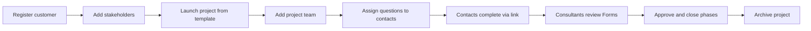

# Platform guide for consultants and platform owners

This guide explains how to use the sustainability and governance reporting platform from a **business perspective**. It is written for **consultant managers**, **consultants**, and **platform owners** who run reporting engagements for their clients. It does not cover installation, databases, or development.

The interface can be shown in **English** or **Turkish**; menu labels may differ slightly, but the workflows are the same.

---

## What this platform is for

The platform helps consulting firms and in-house sustainability teams:

- Maintain a **directory of client organizations** (customers) and their people
- Run **reporting projects** (for example GRI, CSRD, TSRS, or sector-specific frameworks)
- Collect answers through structured **forms** (questionnaires)
- **Assign** specific questions to internal colleagues or external customer contacts
- Track **progress**, **tasks**, and an **audit trail** of who did what
- Optionally use a **knowledge base** and **AI chat** to support consultants with domain content

Think of it as the operational hub for a reporting cycle: from “we have a new client” to “stakeholders have submitted their data and the project team can review it.”

---

## Who uses the platform and what they can do

### Platform-level roles

These roles apply across the whole organization (your consulting firm or program office).

| Role | Typical user | What they can do |
|------|----------------|------------------|
| **Platform administrator** | IT owner, product owner, lead partner | Full access: users, audit log, platform settings, sectors, service categories, knowledge base, translations, and all projects and customers |
| **Consultant manager** | Engagement lead, practice manager | Manage the **customer list** (create and edit clients), access **all projects**, adjust **project settings** and **project team** assignments; work with templates where permitted |
| **Consultant** | Project consultant, analyst | Work on **projects** they are involved in, use **tasks**, **forms**, and **assignments**; typically does not manage the global customer registry or platform settings |
| **Customer user** | Client employee with a login | Sees **projects and tasks** they are assigned to; permissions on a given project depend on their **project role** (see below) |

Some organizations also use **read-only** or **viewer** style access for people who should see limited information without changing data.

### Project-level roles

When someone is added to a **project team**, they get an additional role **for that project only**:

| Project role | Purpose |
|--------------|---------|
| **Project admin** | Can manage project setup, team, assignments, and sensitive actions for that project |
| **Project editor** | Can work on forms, responses, and day-to-day project content |
| **Project viewer** | Can review progress and content with limited ability to change things |

A person’s platform role and their project role work together: for example, a **customer user** who is a **project editor** on one engagement can edit forms there, but may not see other clients’ projects.

---

## Signing in and account basics

### Logging in

1. Open your organization’s platform URL (provided by your administrator).
2. Enter your **email** and **password**, then choose **Sign in**.
3. If your organization enables it, you may also use **login with OTP** (a one-time code sent to your email).

### Password problems

- Use **Forgot password** on the login screen to receive a reset link by email.
- Platform administrators can help users who are locked out or need a password reset from the **Users** area.

### Your profile

Open **Profile** from the sidebar to see:

- Your name and email  
- Your **current platform role**  
- **Projects** assigned to you  
- Recent **activities** on your account  

Use **Sign out** when you finish on a shared computer.

---

## Finding your way around

After login you land on the **Dashboard**, which summarizes active work and links to **Projects** and **Tasks**.

### Main navigation (everyday work)

| Area | What it is for |
|------|----------------|
| **Dashboard** | Welcome view, shortcuts, and contextual help |
| **Customers** (directory) | Browse client organizations you are allowed to see—useful for consultants who need context without managing the master customer list |
| **Projects** | All reporting engagements; create new projects and open project detail |
| **Tasks** | Assignments across projects—what you and others still need to complete |
| **AI Chat** | Ask questions using content from the organization’s knowledge bases (where enabled) |

### Administration navigation (platform owners and managers)

Visible depending on your role:

| Area | What it is for |
|------|----------------|
| **Customers** (management) | Create and maintain the official **customer registry** (consultant managers and platform administrators) |
| **Users** | Invite and manage platform accounts |
| **Sectors** | Define **customer sectors** and link **reporting templates** (datasets) to each sector |
| **Service categories** | Alternative way to group **service categories** and templates |
| **Knowledge base** | Upload and manage documents that power AI-assisted answers |
| **Audit** | Review who changed what across the system |
| **Translations** | Manage UI languages |
| **Settings** | Branding, help videos, reporting **domains**, and integration guidance |

**Templates** (question / data collection sets) are usually reached from **Sectors** or **Service categories**: they define the pages and questions that become a project’s **forms**.

---

## Customers (client organizations)

A **customer** is a client company or entity you report for.

### Creating and maintaining customers

Users with **customer management** access can:

- **Register a new customer** with company name, sectors, country, website, description, and logo  
- Record **operational geographies**, **brand portfolio**, and **employee** breakdowns where relevant  
- Assign one or more **sectors** so the right reporting templates are available later  

### Customer profile (deep view)

Opening a customer shows a rich profile, including:

- **Customer details** — legal and descriptive information  
- **Customer stakeholders** — named contacts at the client (see next section)  
- **Customer branches** — local offices or sites  
- **Client projects** — active and past reporting projects for this customer  
- **Customer project users** — platform users tied to this client’s work  

From the profile you can **launch a new reporting cycle** (create a project) when templates and sectors are configured.

### Customer directory vs customer management

- **Customer directory** — browse and open profiles (for most consultants).  
- **Customers (administration)** — full list with **create** and **edit** (consultant managers and platform administrators).

If you only see projects and tasks, your role may be limited to engagements you are assigned to—not the global customer list.

---

## Contacts and stakeholders

**Stakeholders** (also called contacts) are people at the customer organization who provide data or approvals. They are stored on the **customer profile**, not as separate “login accounts” unless you also invite them as users.

For each stakeholder you typically record:

- Name and **role** (for example sustainability manager)  
- **Email** and phone  
- Optional **LinkedIn** profile  

### When contacts answer questions without a full login

For many engagements, contacts do **not** need a platform account. Instead:

1. On a project, you **assign questions** to a stakeholder.  
2. The system prepares a **secure link** (and optionally an email) for that person.  
3. They open the link, complete their **assignment**, and **submit** responses to the consultant team.

This keeps friction low for busy client contacts while still tracking who answered what.

### Customer users vs contacts

| | **Contact (stakeholder)** | **Customer user (platform account)** |
|--|---------------------------|--------------------------------------|
| Access | Usually via **assignment link** | **Login** to the platform |
| Typical use | Fill assigned questionnaire sections | Ongoing access to assigned projects and tasks |
| Managed on | Customer profile → stakeholders | **Users** (admin) and project **Users** tab |

---

## Projects (reporting engagements)

A **project** is one reporting cycle—for example “ACME — GRI 2025 Report.”

### Creating a project

1. Go to **Projects** (or launch from a **customer profile**).  
2. Choose **New project** / **Launch reporting project**.  
3. Enter a **title**, **category** (project vs service), **customer**, and **reporting template** (dataset).  
4. Confirm **start** and **end** dates and **status** (active, closed, archived).

The template copies its **pages** and **questions** into the project as **forms**.

### Project list views

Filter projects by **active**, **closed**, or **archived**, and search by project or customer name.

### Project settings (overview tab)

Project leads can configure:

- **Core details** — name, customer, dates, status, dataset in use  
- **Project domains** — which reporting themes apply (for example environmental, social), from the global list in **Settings**  
- **Assignment rules** — whether each question can go to **one person only** or **multiple people**  
- **Help / tutorial video** — optional video shown to users via the in-project **Help** button  
- **External resources** — links useful for the team  

The overview also shows **cards** for overall progress: forms, assignments, and users.

---

## Inside a project: the main tabs

Open any project to work in five areas.

### 1. Overview

High-level **progress**, key counts (questionnaires approved vs pending, assignments completed), and project metadata. Use this in steering meetings and status calls with the client.

### 2. Forms

This is the heart of data collection.

- Questions are grouped by **pages** (from the template).  
- Use page tabs to focus on one section, or **All pages** to see the full questionnaire in one scrollable view.  
- Each question can show **guidance**, **examples**, and **submission history** (who answered and when).  
- Consultants can **review**, **approve**, or work through **draft** content depending on your process.  
- Where permitted, consultants may **submit on behalf of** a customer contact; such actions are recorded in **Activity**.

Forms are where you ensure data quality before narrative or export steps.

### 3. Users & assignments

Combines **who is on the project** and **who must answer which questions**.

**Project team**

- Add **platform users** (consultants or customer users) with a **project role** (admin, editor, viewer).  
- Remove or change roles as the engagement evolves.

**Assignments**

- Select questions (by page, code, or label filters).  
- Assign to a **platform user** or a **customer contact**.  
- Set **due dates**; preview or send **email** with a secure link for contacts.  
- Save dates without sending email when you are still planning.

Assignment rules on the project (single vs multiple recipients per question) prevent accidental double-assignment or allow parallel input where needed.

### 4. Plan

A **project plan** view aligned to questions and tasks—useful for scheduling waves of data collection and seeing completion by item. If the plan does not load, contact your platform administrator.

### 5. Activity

A chronological **audit** of project actions: edits, assignments, submissions, and on-behalf entries.

Filter by **person** and **month/year** when investigating “who changed this in March?” or preparing for audits.

---

## Tasks and completing assignments

### For consultants

Open **Tasks** to see assignments **across all projects**:

- Filter by project, status, or “my” pending vs completed work  
- Open a task to see **assigned questions**, progress, comments, and evidence attachments  
- Track **stakeholder** tasks separately from work **assigned to you**

### For contacts (email link)

Contacts who receive an assignment link see a focused **response** experience:

- Only the questions assigned to them  
- Guidance and examples per question  
- Ability to attach **evidence** (documents) where required  
- **Submit to consultant** when the section is complete  

After submission they can often **review or edit** answers until the consultant closes the phase.

### For customer users (logged in)

Customer users use **Tasks** and project **Forms** similar to consultants, but only within projects where they are on the team with sufficient **project role**.

---

## Knowledge base and AI chat

**Platform administrators** maintain **knowledge bases**: collections of documents (guides, policies, prior reports) that describe your methodology and standards.

- Each knowledge base can be **general** or scoped to a **customer** or **project**.  
- Documents are processed so consultants can query them from **AI Chat**.  

**Consultants** use **AI Chat** to ask natural-language questions and get answers grounded in approved internal content—useful for consistency across engagements, not as a substitute for client-specific facts you have not uploaded.

---

## Platform owner checklist

If you own or operate the platform for your firm, plan these foundations before large rollouts:

1. **Branding** — platform name and logos in **Settings**  
2. **Reporting domains** — tags for questions and projects (environmental, social, governance, etc.)  
3. **Sectors and templates** — correct datasets per industry or service line  
4. **Users and roles** — platform administrators, consultant managers, consultants, and customer users  
5. **Help content** — tutorial videos and markdown guidance per page (Dashboard, Projects, Tasks, etc.)  
6. **Knowledge bases** — core methodology documents for AI Chat  
7. **Audit** — periodic review of sensitive actions  

Optional: your **Settings** area may document a **customer-facing API** for pulling project and customer data into external tools. That is intended for integration teams; day-to-day consultants normally work entirely in the web application.

---

## Typical end-to-end workflow

The following flow is a practical pattern many teams follow:

1. **Platform owner** sets sectors, templates, and domains.  
2. **Consultant manager** creates the **customer** and **stakeholders**.  
3. **Consultant manager or lead consultant** **launches the project** and sets dates and domains.  
4. **Project admin** adds **team members** and **assigns questions**.  
5. **Contacts** complete tasks via **secure links**; **customer users** may work in **Tasks** / **Forms**.  
6. **Consultants** review submissions on **Forms**, use **Activity** for traceability, and update the **Plan**.  
7. When the cycle ends, set project status to **closed** or **archived**.

---

## Tips for consultant managers

- **One customer record per legal entity** — use branches for sites, not duplicate customers.  
- **Keep stakeholders current** — assignment emails go to the address on the stakeholder record.  
- **Match sector to template** — wrong sector limits which datasets appear at project launch.  
- **Clarify assignment rules early** — single-recipient vs multi-recipient affects how you split work.  
- **Use Activity filters** during disputes or audits instead of informal spreadsheets.  
- **Use project roles sparingly** — give **project admin** only to leads who must change settings or assignments.  
- **Prefer links for occasional contacts** — reserve **customer user** accounts for people who work across multiple waves.

---

## Getting help inside the product

- Many pages show a **?** or **Guidance** panel with text and sometimes a **tutorial video** configured by your platform owner.  
- **Dashboard** disclaimers summarize what your **role** allows.  
- For access issues, contact your **platform administrator**; for content questions on a project, contact the **project admin** or engagement lead.

---

## Related documentation

- **Technical architecture** (for developers and IT): [tech-stack-architecture.md](./tech-stack-architecture.md)

---

*Last updated for product capabilities including: customer directory, project forms (including all-pages view), users and assignments, activity filters, on-behalf submissions, knowledge base, and AI chat.*
